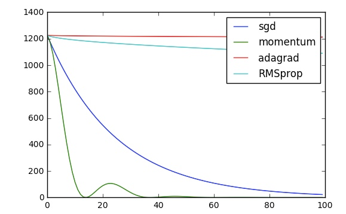

# Optimizers
Comparing the Optimizers in Machine Learning
### Plotting the Loss vs Epoch for x^2 function  

### Blogs for Better Understanding
- [Sebastian Ruder's Blog](http://ruder.io/optimizing-gradient-descent/index.html)
- [Stanford CS:231n](http://cs231n.github.io/optimization-1/)
